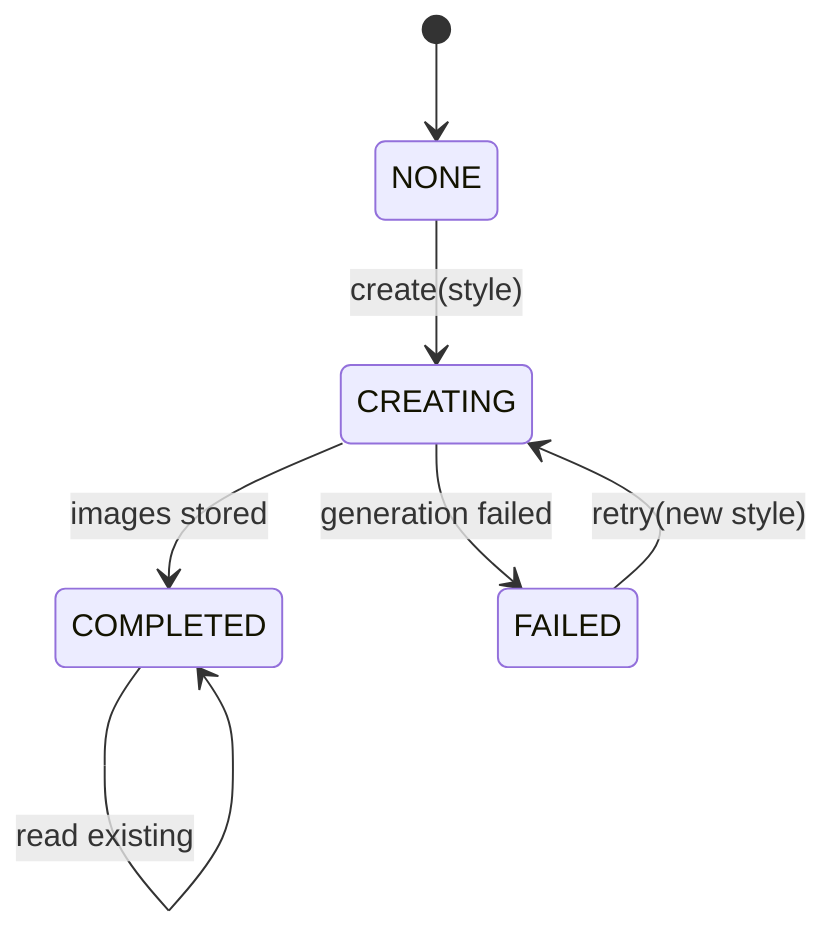

# 지난 여행 AI Recap 기능 설계

## 작업 정보

- 대상 repo: `togethertrip-server-main`
- 상태: 인터뷰 기반 사전 설계
- 이슈: [#101 feat: 지난 여행 AI Recap 생성 기능](https://github.com/together-trip/togethertrip-server-main/issues/101)
- 목표: 여행 종료 후 정산까지 완료된 여행에 대해, 사용자가 직접 요청하면 AI가 여러 장면의 9:16 이미지 recap을 생성하고 여행 멤버 전체가 공유해서 볼 수 있게 한다.

## 문제 정의

여행이 끝난 뒤 TogetherTrip에는 일정, 장소, 사진, 소비, 정산 같은 기록이 남지만, 사용자가 다시 추억하기 좋은 형태로 재구성되지는 않는다. 사용자는 여행을 마무리한 뒤 앱 안에서 자연스럽게 지난 여행을 돌아보고, 멤버들과 같은 결과물을 공유하고, 외부에도 저장/공유할 수 있어야 한다.

AI Recap은 기록을 단순 요약하는 기능이 아니라, 여행 데이터와 업로드 사진을 바탕으로 여러 장면의 스토리형 이미지를 만들어 주는 기능이다.

## 확정된 제품 정책

### 생성 조건

- 여행 종료일이 현재 시점보다 과거여야 한다.
- 여행 정산이 완료되어야 한다.
- 조건을 만족하지 않으면 앱에서 recap 섹션을 아예 숨긴다.

### 생성 방식

- 자동 생성하지 않는다.
- 사용자가 여행 상세 화면에서 직접 요청해야 한다.
- 생성은 비동기 작업으로 처리한다.
- 사용자는 생성 요청 후 다른 화면으로 이동할 수 있다.
- 완료되면 여행 멤버 전체에게 푸시 알림을 보낸다.

### 공유 범위

- Recap은 사용자 개인 리소스가 아니라 여행 단위 공유 리소스다.
- 여행 멤버 중 한 명이 생성하면 모든 여행 멤버가 같은 recap을 본다.
- 이미 생성된 recap이 있으면 다른 멤버가 다시 요청해도 기존 recap을 보여준다.
- v1에서는 완료된 recap 재생성을 제공하지 않는다.

### 결과물

- 여러 장면으로 구성된 스토리형 이미지 recap이다.
- 장면 수는 AI가 3~7장 사이에서 결정한다.
- 이미지 비율은 9:16 세로형이다.
- 이미지 안에는 텍스트, 문장, 글자, 로고성 문구를 넣지 않는다.
- 앱 화면에도 장면별 문장/캡션은 넣지 않는다.
- 사용자 노출 텍스트는 여행 제목, 날짜, 버튼, 상태 표시 같은 최소 UI 요소로 제한한다.

### 이미지 스타일

생성 요청 전에 사용자가 스타일을 선택한다.

- `PHOTO`: 현실 사진 느낌. 시네마틱 여행 스냅샷, 자연스러운 장소/분위기 중심.
- `ILLUSTRATION`: 감성 일러스트 느낌. 여행지를 감성적으로 재해석한 포스터/일러스트 분위기.

공통 제약:

- 이미지 안에 텍스트 없음
- 얼굴 클로즈업 없음
- 특정 멤버와 닮은 인물 생성 없음
- 사람은 장면에 어울릴 때만 자연스럽게 등장
- 인물은 뒷모습, 실루엣, 손, 함께 걷는 장면 정도로 제한

### 데이터 사용

가능한 전체 여행 데이터를 생성 입력으로 사용한다.

- 여행 제목
- 여행 기간
- 목적지/장소
- 일정
- 정산 내역
- 업로드 사진
- 참여 멤버 수

멤버 이름과 프로필 이미지는 AI 입력에서 제외한다. 결과물이 이미지 중심이고 개인정보/초상권 리스크가 커지기 때문이다. 정산 내역은 금액 자체를 드러내는 목적이 아니라 식사, 이동, 입장권, 활동 같은 장면 후보를 풍부하게 하는 보조 신호로만 사용한다.

### 저장/공유

- 생성된 이미지는 AI API 임시 URL을 그대로 쓰지 않고 자체 스토리지에 저장한다.
- DB에는 스토리지 object key 또는 public/read URL을 저장한다.
- 앱에서는 현재 장면 1장 저장/공유와 전체 recap 저장/공유를 둘 다 제공한다.
- v1의 전체 공유는 여러 장 이미지를 한 번에 공유하는 방식으로 잡는다.
- 여러 장면을 영상/릴스 형태로 렌더링하는 기능은 v2로 미룬다.

## UI/UX 흐름

### 여행 상세 화면

상태 기반 recap 섹션을 노출한다.

| 상태 | 조건 | UI |
|------|------|----|
| 숨김 | 여행 종료 전 또는 정산 미완료 | 섹션 없음 |
| 생성 가능 | 조건 충족, recap 없음 | 스타일 선택 + `Recap 만들기` |
| 생성 중 | `CREATING` | 생성 중 상태, 중복 요청 방지 |
| 실패 | `FAILED` | 실패 안내 + 스타일 재선택 + 다시 시도 |
| 완료 | `COMPLETED` | `Recap 보기` |

### Recap 뷰어

인스타 스토리 패턴을 따른다.

- 상단 진행 바
- 일정 시간 후 자동으로 다음 장면
- 좌/우 탭으로 이전/다음
- 길게 누르면 일시정지
- 닫기 버튼으로 종료
- 저장/공유 액션 제공

## 백엔드 도메인 모델

### `trip_recaps`

여행당 하나의 recap을 표현한다.

권장 컬럼:

- `id`
- `trip_id`
- `requested_by_user_id`
- `style`: `PHOTO`, `ILLUSTRATION`
- `status`: `CREATING`, `COMPLETED`, `FAILED`
- `scene_count`
- `attempt_count`
- `failure_reason`
- `created_at`, `updated_at`, `completed_at`

제약:

- `trip_id` unique
- 여행 멤버만 생성/조회 가능
- 생성 조건 검증은 서비스에서 수행

### `trip_recap_scenes`

Recap을 구성하는 장면 이미지다.

권장 컬럼:

- `id`
- `recap_id`
- `scene_order`
- `style`
- `image_object_key`
- `image_url`
- `scene_description`
- `image_prompt`
- `generation_provider`
- `generation_model`
- `created_at`, `updated_at`

정책:

- `scene_order`는 1부터 시작한다.
- 사용자에게 `scene_description`과 `image_prompt`는 노출하지 않는다.
- 내부 프롬프트/설명은 디버깅, 품질 개선, 재시도, 벤더 교체를 위해 저장한다.

## 상태 머신



API 응답에서는 `NONE`을 DB 상태로 저장하지 않고, recap 행이 없을 때 계산된 상태로 내려준다.

## API 초안

### 상태 조회

`GET /api/trips/{tripId}/recap/status`

역할:

- 여행 상세 화면에서 recap 섹션 노출 여부와 상태를 판단한다.
- 조건 미충족이면 앱이 섹션을 숨길 수 있도록 `available=false`를 내려준다.

응답 예시:

```json
{
  "available": true,
  "status": "NONE",
  "recapId": null,
  "style": null
}
```

### 생성 요청

`POST /api/trips/{tripId}/recap`

요청:

```json
{
  "style": "PHOTO"
}
```

응답:

```json
{
  "recapId": 10,
  "status": "CREATING"
}
```

정책:

- 여행 멤버만 호출 가능
- 생성 조건 미충족이면 실패
- 이미 `COMPLETED` 또는 `CREATING` recap이 있으면 기존 상태를 반환하거나 비즈니스 예외로 중복 생성을 막는다.
- `FAILED` 상태에서는 재시도 API를 사용한다.

### 재시도

`POST /api/trips/{tripId}/recap/retry`

요청:

```json
{
  "style": "ILLUSTRATION"
}
```

정책:

- `FAILED` 상태에서만 허용한다.
- 사용자는 스타일을 다시 선택할 수 있다.
- 기존 recap record를 재사용하고 `attempt_count`를 증가시킨 뒤 `CREATING`으로 변경한다.
- 실패한 scene은 삭제하거나 새 attempt와 구분한다. v1에서는 scene을 새로 교체하는 단순 정책을 권장한다.

### 조회

`GET /api/trips/{tripId}/recap`

응답:

```json
{
  "recapId": 10,
  "tripId": 20,
  "style": "PHOTO",
  "status": "COMPLETED",
  "scenes": [
    {
      "sceneId": 100,
      "order": 1,
      "imageUrl": "https://cdn.example.com/trip-recaps/20/10/1.png",
      "aspectRatio": "9:16"
    }
  ]
}
```

정책:

- 여행 멤버만 조회 가능
- `scene_description`, `image_prompt`, `generation_provider`, `generation_model`은 응답에서 제외한다.

## 서비스 설계

패키지 초안:

```text
com.togethertrip.main.triprecap
  controller
  controller/spec
  domain
  dto/request
  dto/response
  repository
  service
  service/ai
  service/storage
```

### 주요 서비스

- `TripRecapService`
  - 상태 조회
  - 생성 요청
  - 재시도
  - 조회
  - 권한/생성 조건/중복 정책 검증

- `TripRecapGenerationService`
  - 비동기 생성 작업 실행
  - 여행 데이터 수집
  - AI 포트 호출
  - 이미지 스토리지 저장
  - recap 상태 업데이트
  - 완료 outbox 이벤트 발행

- `TripRecapDataCollector`
  - 여행, 일정/장소, 게시글/사진, 정산/소비 데이터를 생성 입력 DTO로 수집
  - 멤버 이름/프로필 이미지는 제외하고 멤버 수만 전달

- `TripRecapImageStorageService`
  - AI 결과 이미지를 자체 스토리지에 업로드
  - object key와 URL 생성 책임 분리

### AI 포트

도메인/애플리케이션 서비스는 특정 벤더를 알지 않게 한다.

```kotlin
interface TripRecapGenerator {
    fun generate(request: TripRecapGenerateRequest): TripRecapGenerateResult
}
```

입력 DTO 초안:

```kotlin
data class TripRecapGenerateRequest(
    val tripTitle: String,
    val startDate: LocalDate?,
    val endDate: LocalDate?,
    val defaultCurrency: String,
    val memberCount: Int,
    val style: TripRecapStyle,
    val imageAspectRatio: String = "9:16",
    val places: List<TripRecapPlaceInput>,
    val scheduleItems: List<TripRecapScheduleInput>,
    val expenseSignals: List<TripRecapExpenseSignal>,
    val photoReferences: List<TripRecapPhotoReference>,
)
```

결과 DTO 초안:

```kotlin
data class TripRecapGenerateResult(
    val provider: String,
    val model: String,
    val scenes: List<TripRecapGeneratedScene>,
)

data class TripRecapGeneratedScene(
    val order: Int,
    val sceneDescription: String,
    val imagePrompt: String,
    val imageBytes: ByteArray,
)
```

구현체:

- v1 초기: `StubTripRecapGenerator`
  - 인터페이스와 저장 흐름 검증용
- 이후: `OpenAiTripRecapGenerator`
  - OpenAI API 연동
  - 텍스트 없는 9:16 이미지 생성
  - 사진이 있으면 참고하고, 없으면 일정/장소/정산 신호 기반 생성

## 비동기 실행 정책

v1은 `main` 서버 내부에서 직접 처리한다.

권장 흐름:

1. `POST /recap` 요청 트랜잭션에서 recap을 `CREATING`으로 저장한다.
2. 트랜잭션 커밋 후 비동기 작업을 시작한다.
3. 비동기 작업은 recap을 다시 조회하고 아직 `CREATING`인지 확인한다.
4. 여행 데이터 수집과 AI 생성, 스토리지 업로드를 수행한다.
5. 성공하면 scenes 저장 후 `COMPLETED`로 변경한다.
6. 완료 이벤트를 outbox에 저장한다.
7. 실패하면 `FAILED`, `failure_reason`, `attempt_count`를 업데이트한다.

주의:

- 긴 AI 호출을 사용자 요청 트랜잭션 안에서 수행하지 않는다.
- 생성 중 서버 재시작으로 작업이 유실될 수 있으므로, 운영 안정화 단계에서는 `CREATING` 오래된 작업을 재시작하는 scheduler 또는 큐 도입을 검토한다.
- v1에서 별도 worker는 만들지 않는다.

## 알림 연동

완료 시 여행 멤버 전체에게 푸시 알림을 보낸다.

main 서버에서는 기존 outbox 패턴에 맞춰 알림 후보 이벤트를 저장한다.

추가 enum 후보:

- `OutboxEventType.TRIP_RECAP_COMPLETED`
- `OutboxAggregateType.TRIP_RECAP`

payload 초안:

```json
{
  "eventVersion": 1,
  "tripId": 20,
  "tripRecapId": 10,
  "tripName": "제주 여행",
  "recipients": [
    { "userId": 1 },
    { "userId": 2 }
  ],
  "occurredAt": "2026-07-06T12:00:00Z"
}
```

정책:

- 이번 기능은 생성 요청자도 알림 대상에 포함한다. 사용자가 요청만 걸어두고 다른 화면으로 이동하는 UX이기 때문이다.
- 탈퇴/삭제/임시 참여자 등 `userId`가 없거나 알림 대상이 아닌 참여자는 제외한다.

## 권한과 보안

- 생성/조회/재시도는 여행 멤버만 가능하다.
- 여행 종료일과 정산 완료 조건은 서버에서 반드시 검증한다.
- 멤버 이름과 프로필 이미지는 AI 입력에서 제외한다.
- AI 프롬프트에는 개인정보, 사용자 식별 정보, 얼굴 닮음 요청을 넣지 않는다.
- AI 이미지에는 텍스트 생성을 금지한다.
- 스토리지 URL은 여행 멤버 접근 정책과 충돌하지 않게 설계한다.
- 내부 prompt/description은 사용자 응답에서 제외한다.

## 실패 정책

- AI 생성, 이미지 다운로드, 스토리지 업로드, DB 저장 중 실패하면 `FAILED`로 전환한다.
- 사용자는 실패 상태에서 스타일을 다시 선택해 재시도할 수 있다.
- 실패 사유는 운영/디버깅용으로 저장하되 사용자에게 원문을 그대로 노출하지 않는다.
- 재시도 시 `attempt_count`를 증가시킨다.

## v1 범위

반드시 포함:

- 생성 가능 조건 판정
- 여행 상세 상태 응답
- 스타일 선택 기반 생성 요청
- 비동기 생성 상태 관리
- 여행 단위 공유 recap
- 3~7장 9:16 이미지 scene
- 자체 스토리지 저장
- 완료 시 멤버 전체 푸시 알림 outbox 이벤트
- 실패 후 스타일 재선택 재시도
- recap 조회 API

제외:

- 자동 생성
- 완료된 recap 재생성
- 사용자별 개인 recap
- 이미지 안/화면의 장면별 문장
- 영상/릴스 파일 생성
- 별도 worker 서비스
- AI 벤더 고정 구현 강결합

## 구현 순서 제안

1. GitHub Issue 생성과 브랜치 생성
2. `triprecap` 도메인/DTO/API 스펙 추가
3. Flyway 마이그레이션으로 `trip_recaps`, `trip_recap_scenes` 추가
4. 상태 조회/생성/재시도/조회 서비스 구현
5. `TripRecapGenerator` 포트와 stub 구현 추가
6. 스토리지 업로드 포트/서비스 연결
7. 완료 outbox payload/type 추가
8. 비동기 generation service 연결
9. 서비스/컨트롤러 테스트 추가
10. `./gradlew test` 검증

## 남은 확인 질문

- 여행 일정/장소 데이터가 현재 main 서버에서 어떤 엔티티로 관리되는지 확인해야 한다.
- 업로드 사진이 post media 기준인지, 별도 trip album 개념이 있는지 확인해야 한다.
- recap 이미지 스토리지 public URL 정책을 기존 게시글/프로필 이미지 정책과 어떻게 맞출지 확인해야 한다.
- notification 서버가 `TRIP_RECAP_COMPLETED` 이벤트 타입을 언제 수용할 수 있는지 확인해야 한다.
